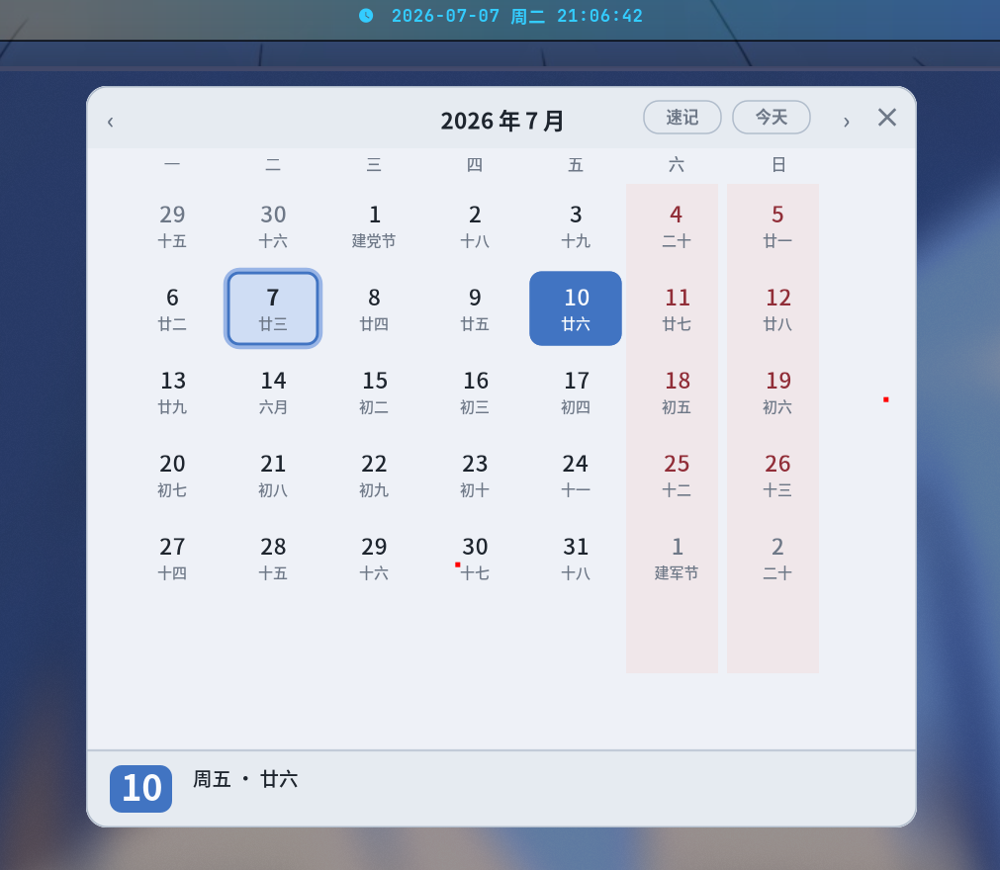
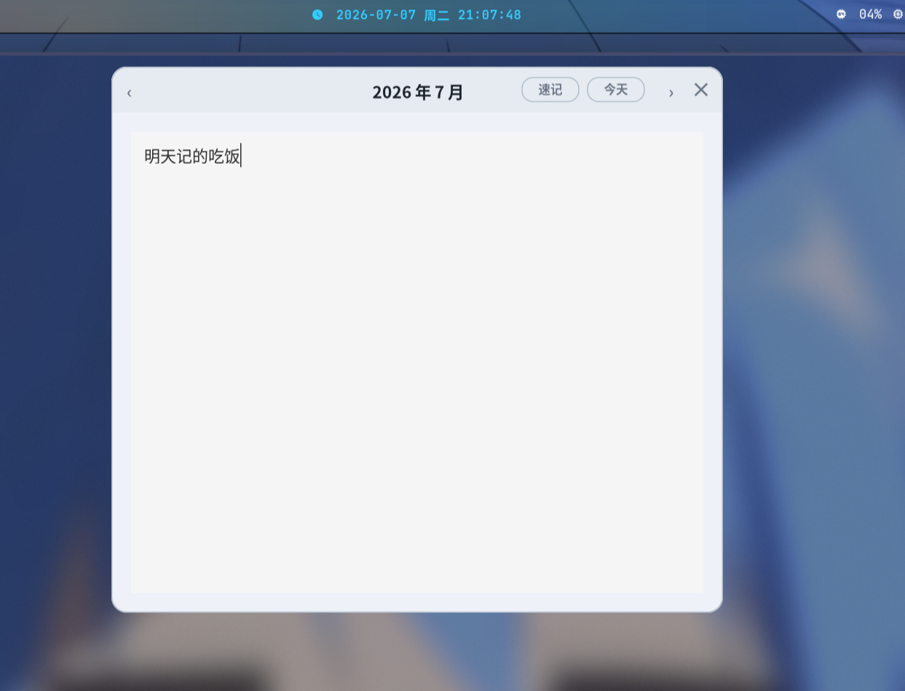

# ironbar 中文日历

基于 GTK4 + gtk4-layer-shell + Cairo 的中文日历弹窗。点击 ironbar 时钟后，日历通过 Wayland `zwlr_layer_shell_v1` 协议锚定在屏幕顶部 bar 下方，零跳变、零延迟。

参考实现：fuzzel、SwayNotificationCenter、wofi

## 效果预览





## 一键安装

```bash
curl -fsSL https://raw.githubusercontent.com/User-HuangX/ironbar-ch-calendar/main/install.sh | bash
```

脚本自动完成：安装系统依赖 → 克隆项目 → 安装 Python 包 → 部署启动脚本。

## 手动安装

### 1. 系统依赖

| 发行版 | 命令 |
|--------|------|
| Arch | `sudo pacman -S gtk4 gtk4-layer-shell` |
| Debian/Ubuntu | `sudo apt install libgtk-4-dev libgtk4-layer-shell-dev` |

### 2. Python 依赖

```bash
uv sync
```

### 3. ironbar 启动脚本

```bash
mkdir -p ~/.config/ironbar
cp ironbar/launch-calendar.sh ~/.config/ironbar/
chmod +x ~/.config/ironbar/launch-calendar.sh
```

### 4. ironbar 配置

在 `~/.config/ironbar/config.corn` 中：

```corn
$clock = {
    type = "label"
    name = "clock"
    label = "{{1000:/path/to/clock-label}}"
    on_click_left = "/home/你的用户名/.config/ironbar/launch-calendar.sh"
    justify = "center"
}
```

然后将 `$clock` 加入 `center = [ $clock ]`。

**不需要 niri window-rule** — layer-shell 协议自动定位。

## 功能

- 公历 + 农历双显示
- 传统节日（春节、元宵、清明、端午、中秋、重阳、除夕）
- 中国法定节假日 + 调休（chinesecalendar）
- 周末列淡底、节日角标、今日光环
- 速记模式：多行文本输入，自动保存到本地
- Esc / ✕ / 点击外部关闭
- ironbar 高度自动检测

## 运行

```bash
uv run python main.py
# 或安装后
ironbar-ch-calendar
```

## 架构

```
ironbar_ch_calendar/
├── app.py              # 入口
├── layer_shell.py      # GTK4 + layer-shell + Cairo 渲染
└── calendar_service.py # 农历/节假日计算
```

## 自定义

- **日历尺寸**：改 `layer_shell.py` 中 `W, H`
- **水平偏移**：改 `GRID_X`
- **配色**：改颜色 RGBA 常量
- **速记数据**：默认保存到 `~/.local/share/ironbar-ch-calendar/shorthand.txt`；如果设置了 `XDG_DATA_HOME`，则保存到 `$XDG_DATA_HOME/ironbar-ch-calendar/shorthand.txt`
